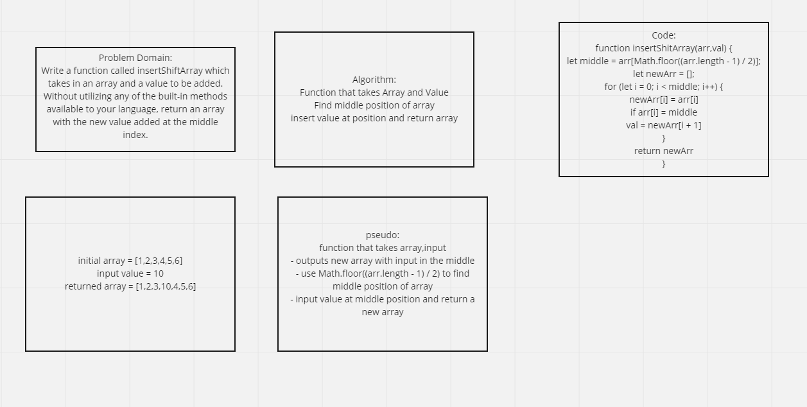

# Insert to Middle of an Array
<!-- Description of the challenge -->
Write a function called insertShiftArray which takes in an array and a value to be added. Without utilizing any of the built-in methods available to your language, return an array with the new value added at the middle index.

## Whiteboard Process
<!-- Embedded whiteboard image -->

## Approach & Efficiency
<!-- What approach did you take? Discuss Why. What is the Big O space/time for this approach? -->

My  approach starts with first finding the middle of the array. I believe using Math.floor allows us to find the middle of an array that is both even and odd lengths. Then creating a new array to push the input value and old array values into. From my understanding of Big O the time will take O(n).